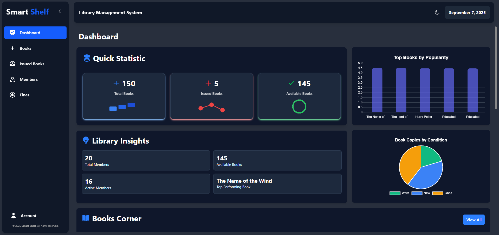
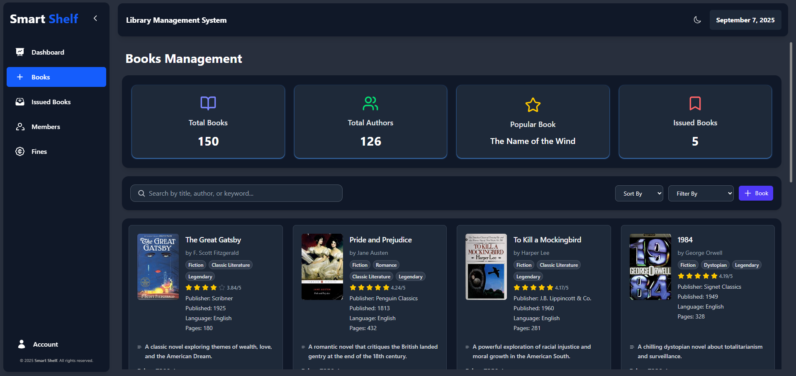
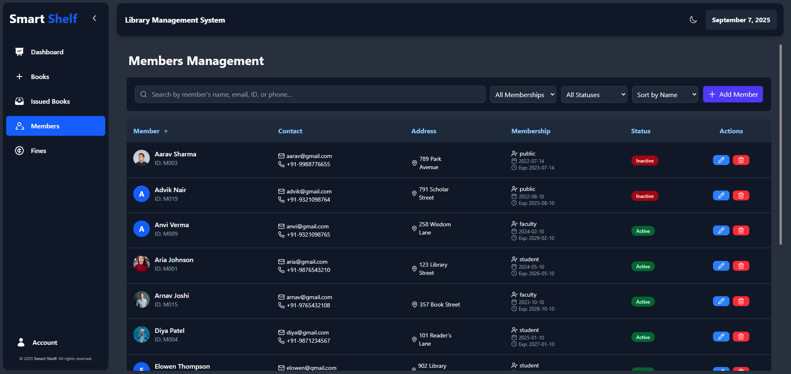

# Smart Shelf LMS - Library Management System.

> A modern and scalable **Learning Management System (LMS)** built with React, Vite, and pnpm.  
> Designed for performance, modularity, and ease of integration.

---

## Status

[](./LICENSE)
[](https://react.dev/)
[](https://vitejs.dev/)
[](https://axios-http.com/)
[](https://pnpm.io/)

---

## 📖 About Smart Shelf LMS

**Smart Shelf LMS** is a modern, lightweight, and modular **Learning Management System** crafted to streamline the way educational institutions manage learning resources and user interactions.

It combines the power of **React**, **Vite**, and **pnpm** to deliver a fast and developer-friendly workflow, while also offering a **clean architecture** that makes the system scalable and easy to maintain.

The platform is designed with flexibility in mind:

- **For administrators** – manage books, resources, and user access.
- **For teachers** – organize course content and assignments.
- **For students** – access digital shelves, explore learning materials, and interact in a simple UI.

Smart Shelf LMS ensures a **seamless user experience** with **light/dark theme support**, **component-driven UI design**, and an **API-first approach** that makes backend integration effortless.

---

## 📸 Sneak Peek

### Dashboard



### Books Page



### Members Page



## 🎥 App Showcase


---

## 🚀 Features

- **Admin-Based Access** – Secure and role-driven platform.
- **Digital Shelf** – Organize and manage books, notes, and other resources.
- **Centralized State Management** – Powered by React Context API for predictable and efficient state handling.
- **Reusable Component Architecture** – Clean and modular UI components for faster development.
- **API-First Design** – Easy integration with REST APIs using Axios.
- **Light & Dark Mode** – User preference support with persistence.
- **Clean Architecture** – A modular folder structure for maintainability and scalability.
- **Performance-Optimized** – Powered by Vite and pnpm for fast builds and package management.

---

## 🛠 Tech Stack

- **Frontend:** React 19.1.1, Vite
- **State Management:** Context API (Redux-ready)
- **HTTP Client:** Axios
- **Package Manager:** pnpm
- **Styling:** Tailwind CSS / CSS Modules
- **Linting & Formatting:** ESLint, Prettier

---

## 📂 Project Structure

```bash
smart-shelf/
├── public/                # Static assets
├── src/
│   ├── app/               # Application configuration
│   ├── assets/            # Images, icons, fonts
│   ├── components/        # Shared UI components
│   ├── contexts/          # Global state management
│   ├── modules/           # Feature-specific modules
│   ├── pages/             # Route-level views
│   ├── router/            # Central routing configuration
│   ├── App.jsx            # Root component
│   ├── index.css          # Global styles
│   └── main.jsx           # Application entry point
├── .gitignore
├── eslint.config.js
├── index.html
├── LICENSE
├── package.json
├── pnpm-lock.yaml
├── pnpm-workspace.yaml
└── vite.config.js
```

## 🛠️ Installation & Setup

### 1. Clone the Repository

```bash
git clone https://github.com/your-username/smart-shelf-lms.git
cd smart-shelf-lms
```

### 2. Install Dependencies

```bash
pnpm install
```

### 3. Run the development server

```bash
pnpm dev
```

### 4. Building for Production

```bash
pnpm build
```

## 📚 Usage

### 🔑 Access the Application

- Open [http://localhost:5173](http://localhost:5173) in your browser after running the development server.
- Log in with the appropriate credentials based on your role (**Admin**, **Teacher**, or **Student**).

---

### 🛠️ Admin Features

- Manage users, resources, and system settings via the **Admin Dashboard**.
- Add, update, or remove books and learning materials in the **Digital Shelf**.

---

### 👩‍🏫 Teacher Features

- Create and manage **course content**.
- Assign tasks and monitor **student progress**.

---

## 🛠️ Development Guidelines

### 📝 Code Style

- Use **ESLint** and **Prettier** for consistent code formatting.
- Follow the provided ESLint configuration (**eslint.config.js**).

---

### 🤝 Contributing

1. **Fork** the repository.
2. Create a new branch:
   ```bash
   git checkout -b feature/your-feature-name
   ```
3. Commit your changes:
   ```bash
   git commit -m "Add Features."
   ```
4. Push to your branch:
   ```bash
   git push origin feature/your-feature-name
   ```
5. Open a Pull Request

## 👥 Contributors

We are grateful to the following contributors who have helped shape **Smart Shelf LMS**:

**Rohit Pakhre** • **Dhiraj Yadav** • **Saloni Fojdar**

## 📄 License

This project is licensed under the **MIT License** – see the [LICENSE](./LICENSE) file for details.

You are free to use, modify, and distribute this software in both personal and commercial projects, provided that the original copyright and license
notice are included in all copies or substantial portions of the software.
